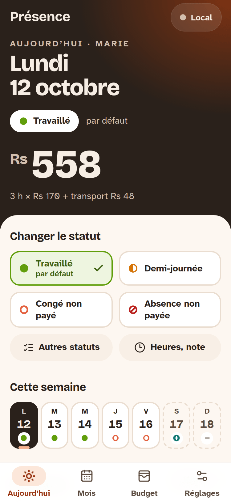
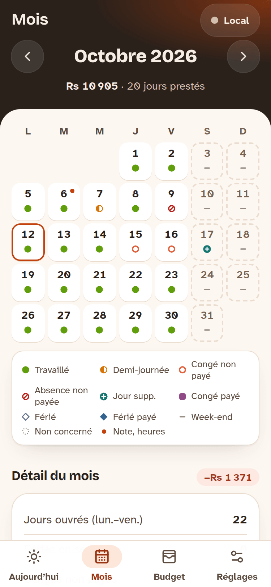
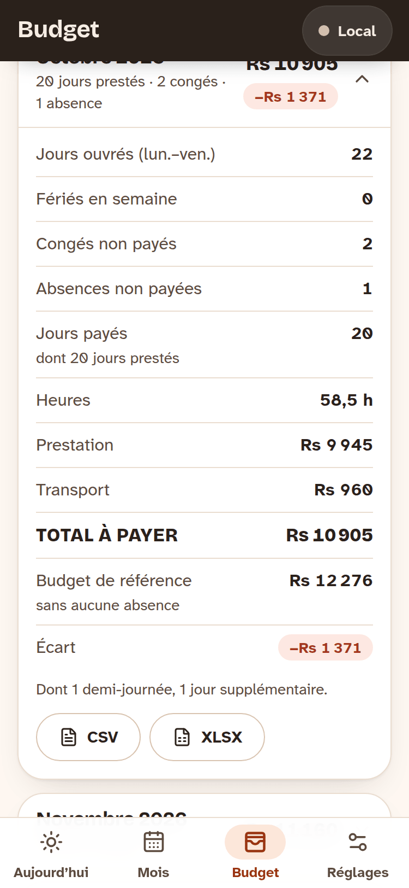
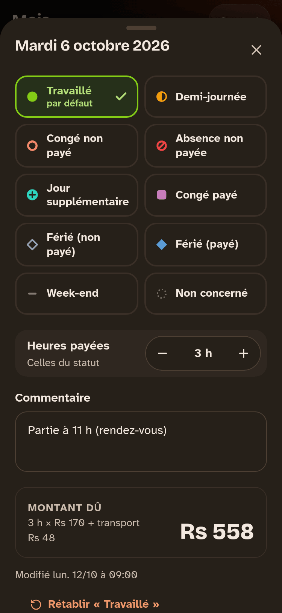

# Présence

PWA de suivi de présence d'une employée de maison à Maurice, pour deux
téléphones synchronisés en temps réel. On y saisit les journées (travaillée,
demi-journée, congé, absence, férié…), l'app calcule le montant dû en roupies
et compare chaque mois au budget de référence. Elle fonctionne hors ligne :
les saisies partent dès que le réseau revient.

<p>
  
  
  
  
</p>

- **Interface** en français, fuseau `Indian/Mauritius`, montants au format « Rs 12 276 ».
- **Stack** : Vite, React, TypeScript, Tailwind CSS, Supabase (Postgres, Auth
  par magic link, Realtime), vite-plugin-pwa (Workbox), Dexie (IndexedDB).
- **Architecture et choix** : voir [docs/PLAN.md](docs/PLAN.md).

## Sommaire

1. [Démarrage rapide](#1-démarrage-rapide)
2. [Créer le projet Supabase](#2-créer-le-projet-supabase)
3. [Variables d'environnement](#3-variables-denvironnement)
4. [Déploiement](#4-déploiement)
5. [Installer l'app sur les téléphones](#5-installer-lapp-sur-les-téléphones)
6. [Règles de calcul](#6-règles-de-calcul)
7. [Tests et critères de validation](#7-tests-et-critères-de-validation)
8. [Fonctionnement hors ligne et synchronisation](#8-fonctionnement-hors-ligne-et-synchronisation)
9. [Dépannage](#9-dépannage)

## 1. Démarrage rapide

Prérequis : Node.js 22 (22.12 ou plus récent) ou 24. La version est bornée
dans `package.json` (`engines`) : Vercel construit avec Node 24 et ne passera
pas tout seul à une nouvelle version majeure.

```bash
npm install
npm run dev          # http://localhost:5173
```

Sans variables Supabase, l'app démarre en **mode local** : pas de connexion,
données enregistrées uniquement sur l'appareil (pastille « Local » en haut à
droite). Pratique pour essayer ; pour partager les données entre les deux
téléphones, suivez les étapes suivantes.

| Commande | Rôle |
| --- | --- |
| `npm run dev` | serveur de développement |
| `npm run build` | vérification TypeScript + build de production dans `dist/` |
| `npm run preview` | sert le build (service worker actif) sur http://localhost:4173 |
| `npm test` | tests unitaires, SQL et contrastes (Vitest) |
| `npm run test:e2e` | tests de bout en bout (Playwright) |
| `npm run icons` | régénère les icônes depuis `scripts/*.svg` |

## 2. Créer le projet Supabase

Les libellés du tableau de bord Supabase peuvent varier légèrement selon les versions.

### 2.1 Projet et schéma

1. Créez un projet sur [supabase.com](https://supabase.com), dans une région
   proche de Maurice (par exemple Mumbai, `ap-south-1`).
2. Appliquez le schéma, **au choix** :
   - **SQL Editor** : exécutez, dans cet ordre, le contenu de
     `supabase/migrations/20260928120000_schema.sql`,
     `supabase/migrations/20260928120100_reference_data.sql`, puis `supabase/seed.sql`
     (jours fériés 2026–2027) ;
   - **CLI Supabase** :
     ```bash
     npx supabase login
     npx supabase link --project-ref <référence-du-projet>
     npx supabase db push --include-seed
     ```

Le schéma crée les tables `settings`, `status_rules`, `holidays`,
`attendance_overrides`, `allowed_emails` (+ une table technique
`attendance_tombstones`), active la RLS, les fonctions de synchronisation et
ajoute les tables à la publication `supabase_realtime` : rien à activer à la
main pour le temps réel.

### 2.2 Autoriser vos deux adresses

Dans le **SQL Editor** :

```sql
insert into public.allowed_emails (email, display_name) values
  ('vous@exemple.com',      'Vous'),
  ('conjointe@exemple.com', 'Conjointe')
on conflict (email) do update set display_name = excluded.display_name;
```

Seules ces adresses peuvent créer un compte (un trigger refuse les autres) et
lire ou écrire les données (policies RLS). Ensuite, la liste se gère depuis
l'app : **Réglages → Comptes**.

### 2.3 Authentification

Dans **Authentication** :

1. **Sign In / Providers → Email** : fournisseur email activé, « Confirm
   email » laissé par défaut. Longueur du code OTP : 6 chiffres.
2. **URL Configuration** :
   - *Site URL* : l'URL de production (ex. `https://presence.vercel.app`) ;
   - *Redirect URLs* : la même URL suivie de `/**`, plus
     `http://localhost:5173/**` et `http://localhost:4173/**` pour le développement.
3. **Emails → Templates → Magic Link** : remplacez le contenu par celui de
   `supabase/templates/magic_link.html`. Il contient **le lien et le code à
   6 chiffres** : sur iPhone, le lien s'ouvre dans Safari et non dans l'app
   installée, on saisit donc le code dans l'app.
4. **Emails → SMTP Settings** : le service d'envoi intégré de Supabase est
   limité (quelques emails par heure, réservé par défaut aux adresses des
   membres de l'équipe du projet). Configurez un SMTP (Brevo, Resend,
   Postmark…) pour que les deux adresses reçoivent leurs emails de connexion.

### 2.4 Clés

**Project Settings → API Keys** : notez l'URL du projet
(`https://<référence>.supabase.co`) et la clé **publishable**
(`sb_publishable_…`), ou l'ancienne clé **anon** pour un projet plus ancien.
La clé *secret / service_role* ne doit **jamais** être utilisée dans l'app.

## 3. Variables d'environnement

Copiez `.env.example` en `.env` (fichier ignoré par git) :

```dotenv
VITE_SUPABASE_URL=https://votre-projet.supabase.co
VITE_SUPABASE_PUBLISHABLE_KEY=sb_publishable_xxxxxxxxxxxxxxxxxxxxxxxx
# ou, pour un projet ancien : VITE_SUPABASE_ANON_KEY=eyJhbGciOi…
```

Ces valeurs sont publiques par nature (elles finissent dans le code du
navigateur) : la sécurité repose sur la RLS et la liste `allowed_emails`.
Aucune clé n'est écrite en dur dans le code.

## 4. Déploiement

Le build produit un site statique (`dist/`). Les chemins `/mois`, `/budget`
et `/reglages` doivent renvoyer `index.html` : c'est prévu pour les deux hébergeurs.

### Vercel

1. *Add New → Project*, importez le dépôt GitHub. `vercel.json` fixe le
   preset Vite, la commande `npm run build`, le dossier `dist`, la réécriture
   SPA et les en-têtes (CSP, cache immuable des assets, pas de cache pour
   `sw.js` et `index.html`).
2. *Settings → Environment Variables* : `VITE_SUPABASE_URL` et
   `VITE_SUPABASE_PUBLISHABLE_KEY` (Production et Preview), puis redéployez.
3. Reportez l'URL obtenue dans Supabase (*Site URL* et *Redirect URLs*). Pour
   les déploiements de prévisualisation, ajoutez aussi
   `https://*-<votre-équipe>.vercel.app/**`.

### Cloudflare Pages

1. *Workers & Pages → Create → Pages → Connect to Git*, choisissez le dépôt.
2. Build command : `npm run build` — Build output directory : `dist`.
3. Variables d'environnement : `VITE_SUPABASE_URL`,
   `VITE_SUPABASE_PUBLISHABLE_KEY` et `NODE_VERSION=22`.
4. `public/_headers` fournit les en-têtes ; sans `404.html`, Pages sert
   `index.html` pour les chemins inconnus (mode SPA).
5. Reportez l'URL `https://<projet>.pages.dev` dans Supabase.

> La CSP autorise `https://*.supabase.co` et `wss://*.supabase.co`. Avec un
> domaine Supabase personnalisé, adaptez `connect-src` dans `vercel.json` et
> `public/_headers`.

## 5. Installer l'app sur les téléphones

**iPhone (Safari)** : ouvrez l'URL, touchez **Partager** puis **Sur l'écran
d'accueil**, puis **Ajouter**. Lancez l'app depuis l'icône (plein écran, sans
barre d'adresse), saisissez votre email et **le code reçu**.

**Android (Chrome)** : ouvrez l'URL, puis **Réglages → Installer l'app** dans
Présence (ou menu ⋮ → *Installer l'application*). Le lien de l'email peut
s'ouvrir directement dans l'app installée ; le code fonctionne aussi.

La première ouverture doit se faire avec du réseau ; ensuite l'app s'ouvre
hors ligne.

## 6. Règles de calcul

Paramètres par défaut (modifiables dans **Réglages**) : Rs 170 / heure,
3 h par jour, transport Rs 48 par jour presté, lundi → vendredi, période du
01/09/2026 au 31/12/2027.

| Statut | Heures payées | Transport | Total/jour |
| --- | ---: | :---: | ---: |
| Travaillé | 3 | oui | Rs 558 |
| Demi-journée | 1,5 | oui | Rs 303 |
| Jour supplémentaire | 3 | oui | Rs 558 |
| Congé non payé | 0 | non | Rs 0 |
| Absence non payée | 0 | non | Rs 0 |
| Congé payé | 3 | non | Rs 510 |
| Férié (non payé) | 0 | non | Rs 0 |
| Férié (payé) | 3 | non | Rs 510 |
| Week-end | 0 | non | Rs 0 |
| Non concerné | 0 | non | Rs 0 |

- `total_jour = heures_payées × taux_horaire + (transport ? montant_transport : 0)`,
  calculé en centimes entiers (`src/domain/pay.ts`, module pur et testé).
- **Statut par défaut**, jamais stocké : samedi/dimanche → Week-end ; date
  présente dans les fériés → Férié (non payé) ; sinon → Travaillé. Un férié
  tombant un dimanche reste un week-end. Hors période, ou un jour de semaine
  retiré des jours de prestation → Non concerné.
- Seules les journées qui s'écartent du défaut sont enregistrées : corriger la
  date d'un férié se répercute automatiquement.
- Un **forçage d'heures** remplace les heures du statut sans toucher au transport.
- **Budget de référence** : le même mois sans aucune saisie. **Écart** = total − budget.
- « Congés non payés » (à la demande de l'employée) et « Absences non payées »
  (imprévus) sont deux compteurs distincts.
- Changer les heures par jour propose d'adapter les statuts (3 h → 4 h, 1,5 h → 2 h).

## 7. Tests et critères de validation

```bash
npm test                          # 245 tests : calculs, formats, SQL, synchro, exports, contrastes
npx playwright install chromium   # une fois
npm run test:e2e                  # 9 scénarios dans Chromium à 375 px
```

- **GitHub Actions** (`.github/workflows/ci.yml`) lance TypeScript, `npm test`, le
  build et `npm run test:e2e` sur chaque pull request et chaque push sur `main`.
- Les tests SQL exécutent les **vraies migrations** dans PGlite (Postgres en
  WebAssembly) avec un bouchon de l'environnement Supabase : RLS, garde
  d'inscription, conflits, idempotence du seed.
- Les tests e2e simulent Supabase (REST, RPC, Auth, Realtime) ; ils
  construisent deux builds (mode local et mode synchronisé). Si Chromium est
  déjà installé ailleurs : `PLAYWRIGHT_CHROMIUM_EXECUTABLE=/chemin/vers/chrome npm run test:e2e`.

| Critère | Vérifié par |
| --- | --- |
| « Congé non payé » en trois taps maximum | e2e : un tap pour aujourd'hui, trois pour un autre jour du mois |
| Modification visible sur l'autre téléphone en moins de 5 s | e2e : événement Realtime seul, écran à jour en < 1 s |
| Mode avion : ouverture, mois affiché, saisie acceptée puis envoyée seule | e2e : rechargement hors ligne via le service worker ; file rejouée dans l'ordre au retour du réseau |
| Période complète : Rs 187 488 pour 336 jours prestés | `src/domain/pay.test.ts` + e2e (écran Budget) |
| Octobre 2026 avec 3 congés non payés : Rs 12 276 → Rs 10 602, écart −Rs 1 674 | `src/domain/pay.test.ts` + e2e (écran Budget) |
| Installation plein écran iOS et Android | manifeste `standalone`, icônes 192/512/maskable, apple-touch-icon, métas iOS (à confirmer sur les appareils) |
| 375 px sans défilement horizontal, cibles ≥ 44 px | e2e sur les quatre écrans |
| Contraste AA, deux thèmes | `tests/contrast.test.ts` (toutes les paires texte/fond des tokens) |

## 8. Fonctionnement hors ligne et synchronisation

- L'interface lit uniquement la base locale (IndexedDB via Dexie) : elle
  s'affiche instantanément, avec ou sans réseau.
- Chaque saisie est ajoutée à une **file d'écritures** locale, affichée tout
  de suite, puis envoyée dans l'ordre. Indicateur en haut à droite :
  « En ligne », « Hors ligne », « n en attente » ; touchez-le pour le détail.
- **Conflits** : dernière écriture gagnante selon l'heure de la saisie
  (`updated_at`). Une saisie hors ligne ancienne, rejouée plus tard, n'écrase
  pas une modification plus récente de l'autre téléphone, et ne ressuscite pas
  une journée remise au défaut entre-temps. Le détail d'une journée indique qui
  l'a modifiée en dernier et quand.
- Réglages et statuts sont modifiés champ par champ (deux changements de
  champs différents faits hors ligne sont tous deux conservés).
- Le service worker précache l'application et les polices, sert l'app hors
  ligne et applique *stale-while-revalidate* aux lectures Supabase.
- La file est rejouée quand l'app est ouverte (au retour du réseau, au retour
  au premier plan ou à la prochaine ouverture).

## 9. Dépannage

- **« Adresse non autorisée »** : ajoutez l'adresse dans `allowed_emails`
  (voir 2.2) ou depuis Réglages → Comptes sur l'autre téléphone.
- **Pas d'email reçu** : vérifiez les spams et configurez un SMTP (2.3) ; le
  service intégré de Supabase est très limité.
- **Le lien ouvre Safari au lieu de l'app** : c'est le comportement d'iOS ;
  saisissez le code de l'email dans l'app installée.
- **« Accès non autorisé » après connexion** : l'adresse n'est pas (ou plus)
  dans `allowed_emails`.
- **Eid-Ul-Fitr 2027** : date à confirmer selon la lune ; corrigez-la dans
  Réglages → Jours fériés dès l'annonce officielle.
- **Garde d'inscription** : si votre projet interdisait les triggers sur
  `auth.users`, la migration l'indique (NOTICE) sans échouer ; les données
  restent protégées par la RLS. Vous pouvez alors utiliser le hook
  d'authentification *Before User Created* de Supabase.
